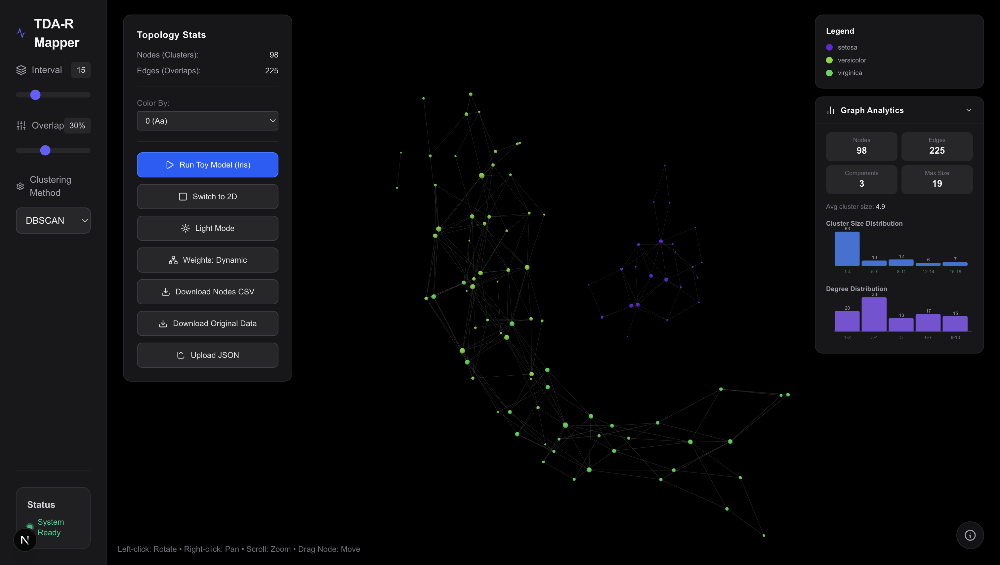

# TDA-R Mapper



## Introduction

**TDA-R Mapper** is an advanced web application designed for **Topological Data Analysis (TDA)** visualization. By integrating **WebR**, it executes the R-based `MapperAlgo` algorithm directly within your browser, enabling powerful, server-less exploration of high-dimensional data structures.

This tool allows researchers and data scientists to visualize the shape of their data, identify clusters, and understand complex relationships through an interactive 3D network graph.

### Key Features

*   **Serverless R Backend**: Powered by WebR to run statistical computations entirely on the client side.
*   **Interactive 3D Graph**: Navigate, zoom, and inspect topological networks in a rich 3D environment.
*   **Custom Data Upload**: Support for uploading custom JSON datasets for immediate analysis.
*   **Real-time Tuning**: Instantly adjust Mapper parameters like Interval, Overlap, and Clustering methods (DBSCAN, K-Means, Hierarchical).
*   **Visualization**: Automatic column detection for adaptive node coloring and statistical insights.

## Getting Started

First, run the development server:

```bash
yarn install
yarn dev
```